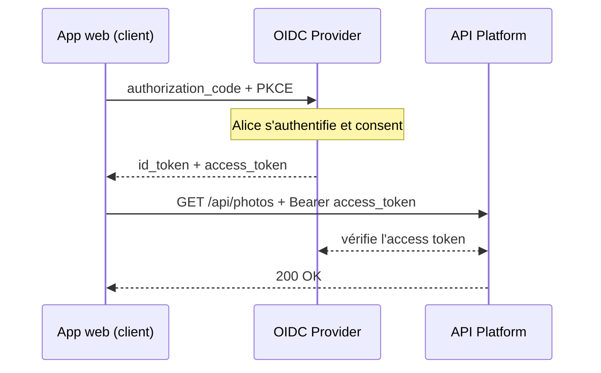

# OIDC ajoute une couche d'identité à OAuth2

<v-clicks>

- 🆔 **ID Token** : JWT avec les claims d'identité
- 📋 **Claims standards** : sub, aud, iss, exp...
- 🔗 **Discovery** : endpoint `.well-known`
- 🔐 **UserInfo** : données utilisateur supplémentaires

</v-clicks>

---
layout: statement
class: sec-authn
---

# OIDC Provider

Un **Provider dédié** émet les tokens et fournit les identités.  
**Indépendamment** de votre API.

---
layout: default
class: sec-authn
---

# Le client obtient les tokens, l'API les vérifie

---
layout: default
class: sec-authn
---

# Les parties prenantes

<CardGrid :cols="3" class="oidc-roles">
  <Card v-click :accent="4" icon="👩‍🦰" title="Alice">
    <b>End-User</b> 
    Utilisateur humain
  </Card>
  <Card v-click :accent="5" icon="🖥️" title="App web">
    <b>Relying Party (RP)</b> 
    Le client qui réclame l'authentification et les claims.
  </Card>
  <Card v-click :accent="6" icon="🛂" title="OIDC Provider">
    <b>OpenID Provider (OP)</b> 
    Authentifie Alice, puis fournit les claims au RP.
  </Card>
</CardGrid>

<v-click>

  🧩
  
    Et <b>votre API Platform</b> ?  Un <b>Resource Server</b> : une dénomination OAuth2, que la spec OIDC ne change pas.
  

</v-click>

---
layout: default
class: sec-authn
---

# Deux tokens, deux destinataires

<CardGrid :cols="2" class="mt-8">
  <Card v-click :accent="4" icon="🪪" title="ID token">
    Pour l'<b>application cliente</b>. 
    Qui est l'utilisateur, et comment il s'est authentifié.  
    > Carte d'identité
  </Card>
  <Card v-click :accent="6" icon="🎫" title="Access token">
    Pour l'<b>API</b>. 
    Ce que le porteur a le droit de faire.  
    > Billet de concert
  </Card>
</CardGrid>

<v-click>

<Alert type="warning">

L'ID token n'est **pas** une clé d'accès à l'API. Seul l'**access token** l'est.

</Alert>

</v-click>

---
layout: default
class: sec-authn
---

# Les JW* expliqués {class="!mb-4"}

| Acronyme   | Nom complet                        | Rôle                                                 | Métaphore                                    | Est-ce un token ?                                              |
|------------|------------------------------------|------------------------------------------------------|----------------------------------------------|----------------------------------------------------------------|
| **JWT**    | **J**SON **W**eb **T**oken         | Définit la structure des claims dans le payload.     | Le courrier ou le contenu du colis           | Oui, bien qu'il ne soit jamais utilisé sans structure JWS/JWE. |
| **JWS**    | **J**SON **W**eb **S**ignature     | Fournit l'intégrité et l'authenticité via une signature. | Une enveloppe transparente avec un sceau inviolable | Oui, un token signé.                                    |
| **JWE**    | **J**SON **W**eb **E**ncryption    | Fournit la confidentialité via le chiffrement.       | Une boîte métallique opaque et verrouillée   | Oui, un token chiffré.                                         |

---
layout: default
class: sec-authn
---

# Les JW* expliqués {class="!mb-4"}

| Acronyme   | Nom complet                        | Rôle                                                 | Métaphore                                    | Est-ce un token ?                              |
|------------|------------------------------------|------------------------------------------------------|----------------------------------------------|------------------------------------------------|
| **JWA**    | **J**SON **W**eb **A**lgorithms    | Définit les algorithmes cryptographiques autorisés.  | La liste des types de serrures/sceaux approuvés | Non, c'est une liste de noms.               |
| **JWK(S)** | **J**SON **W**eb **K**ey (**S**et) | Un format standard pour représenter une (un ensemble de) clé(s). | La (les) clé(s) elle(s)-même(s) et ses métadonnées | Non, c'est un format de (jeu de) clé(s). |
