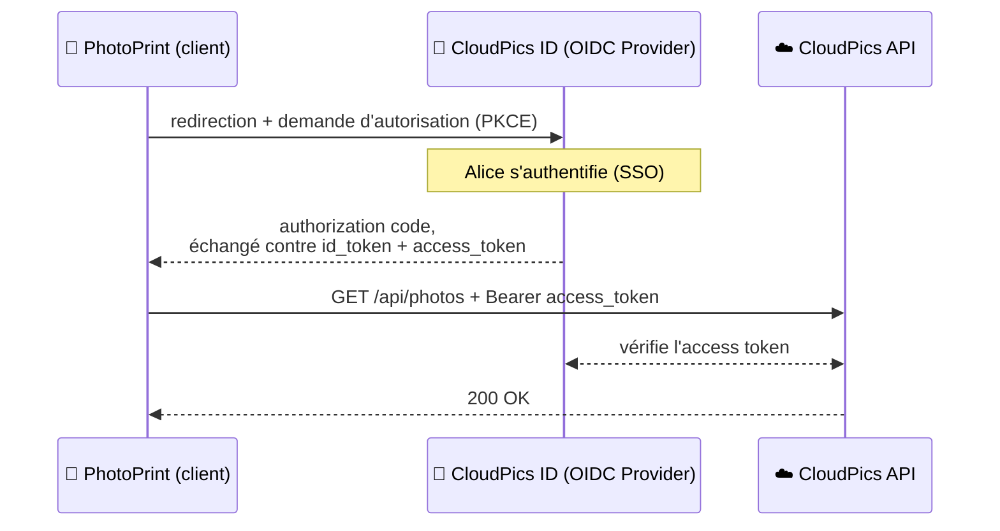

# OIDC ajoute une couche d'identité à OAuth2

<v-clicks>

- 🆔 **ID Token** : JWT avec les claims d'identité
- 📋 **Claims standards** : sub, aud, iss, exp...
- 🔗 **Discovery** : endpoint `.well-known`
- 🔐 **UserInfo** : données utilisateur supplémentaires

</v-clicks>

---
layout: statement
class: sec-authn
---

# OIDC Provider

Un **Provider dédié** émet les tokens et fournit les identités.  
**Indépendamment** de votre API.

Dans notre histoire : CloudPics confie l'identité à <b>CloudPics ID</b>. Son API ne garde que les photos.

---
layout: default
class: sec-authn
---

# Le client obtient les tokens, l'API les vérifie

```mermaid
sequenceDiagram
    participant C as 🌁 PhotoPrint (client)
    participant P as 🛂 CloudPics ID (OIDC Provider)
    participant A as ☁️ CloudPics API

    C->>P: redirection + demande d'autorisation (PKCE)
    Note over P: Alice s'authentifie (SSO)
    P-->>C: authorization code,<br/>échangé contre id_token + access_token
    C->>A: GET /api/photos + Bearer access_token
    A<<-->>P: vérifie l'access token
    A-->>C: 200 OK
```

---
layout: default
class: sec-authn
---

# Les parties prenantes

<CardGrid :cols="3" class="oidc-roles">
  <Card v-click :accent="4" icon="👩‍🦰" title="Alice">
    <b>End-User</b> 
    Utilisateur humain
  </Card>
  <Card v-click :accent="5" icon="🌁" title="PhotoPrint">
    <b>Relying Party (RP)</b> 
    Le client qui réclame l'authentification et les claims.
  </Card>
  <Card v-click :accent="6" icon="🛂" title="CloudPics ID">
    <b>OpenID Provider (OP)</b> 
    Authentifie Alice, puis fournit les claims au RP.
  </Card>
</CardGrid>

<v-click>

  🧩
  
    Et <b>CloudPics API</b>, votre API Platform ?  Un <b>Resource Server</b> : une dénomination OAuth2, que la spec OIDC ne change pas.
  

</v-click>

---
layout: default
class: sec-authn
---

# Deux tokens, deux destinataires

<CardGrid :cols="2" class="mt-8">
  <Card v-click :accent="4" icon="🪪" title="ID token">
    Pour l'<b>application cliente</b>. 
    Qui est l'utilisateur, et comment il s'est authentifié.  
    > Carte d'identité
  </Card>
  <Card v-click :accent="6" icon="🎫" title="Access token">
    Pour l'<b>API</b>. 
    Ce que le porteur a le droit de faire.  
    > Billet de concert
  </Card>
</CardGrid>

<v-click>

<Alert type="warning">

L'ID token n'est **pas** une clé d'accès à l'API. Seul l'**access token** l'est.

</Alert>

</v-click>

---
layout: default
class: sec-authn
---

# Les JW* expliqués {class="!mb-4"}

| Acronyme | Nom complet                      | Rôle                                                          | Métaphore                          |
|----------|----------------------------------|---------------------------------------------------------------|------------------------------------|
| **JWT**  | **J**SON **W**eb **T**oken       | La structure des claims, toujours emballée en JWS ou JWE      | Le courrier                        |
| **JWS**  | **J**SON **W**eb **S**ignature   | Intégrité et authenticité : un token **signé**                | Une enveloppe transparente scellée |
| **JWE**  | **J**SON **W**eb **E**ncryption  | Confidentialité : un token **chiffré**                        | Une boîte opaque et verrouillée    |
| **JWKS** | **J**SON **W**eb **K**ey **S**et | Les clés publiques du Provider, pour vérifier les signatures  | Le trousseau                       |
