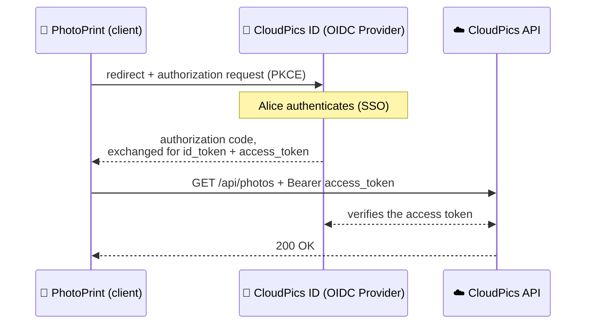

# OIDC adds an identity layer on top of OAuth2

<v-clicks>

- 🆔 **ID Token**: a JWT carrying the identity claims
- 📋 **Standard claims**: sub, aud, iss, exp...
- 🔗 **Discovery**: the `.well-known` endpoint
- 🔐 **UserInfo**: additional user data

</v-clicks>

---
layout: statement
class: sec-authn
---

# OIDC Provider

A **dedicated Provider** issues the tokens and serves the identities.  
**Independently** of your API.

In our story: CloudPics hands identity over to <b>CloudPics ID</b>. Its API only keeps the photos.

---
layout: default
class: sec-authn
---

# The client gets the tokens, the API verifies them

```mermaid
sequenceDiagram
    participant C as 🌁 PhotoPrint (client)
    participant P as 🛂 CloudPics ID (OIDC Provider)
    participant A as ☁️ CloudPics API

    C->>P: redirect + authorization request (PKCE)
    Note over P: Alice authenticates (SSO)
    P-->>C: authorization code,<br/>exchanged for id_token + access_token
    C->>A: GET /api/photos + Bearer access_token
    A<<-->>P: verifies the access token
    A-->>C: 200 OK
```

---
layout: default
class: sec-authn
---

# The stakeholders

<CardGrid :cols="3" class="oidc-roles">
  <Card v-click :accent="4" icon="👩‍🦰" title="Alice">
    <b>End-User</b> 
    A human user
  </Card>
  <Card v-click :accent="5" icon="🌁" title="PhotoPrint">
    <b>Relying Party (RP)</b> 
    The client asking for the authentication and the claims.
  </Card>
  <Card v-click :accent="6" icon="🛂" title="CloudPics ID">
    <b>OpenID Provider (OP)</b> 
    Authenticates Alice, then serves the claims to the RP.
  </Card>
</CardGrid>

<v-click>

  🧩
  
    And <b>CloudPics API</b>, your API Platform app?  A <b>Resource Server</b>: an OAuth2 name, left unchanged by the OIDC spec.
  

</v-click>

---
layout: default
class: sec-authn
---

# Two tokens, two recipients

<CardGrid :cols="2" class="mt-8">
  <Card v-click :accent="4" icon="🪪" title="ID token">
    For the <b>client application</b>. 
    Who the user is, and how they authenticated.  
    > An ID card
  </Card>
  <Card v-click :accent="6" icon="🎫" title="Access token">
    For the <b>API</b>. 
    What the bearer is allowed to do.  
    > A concert ticket
  </Card>
</CardGrid>

<v-click>

<Alert type="warning">

The ID token is **not** a key to the API. Only the **access token** is.

</Alert>

</v-click>

