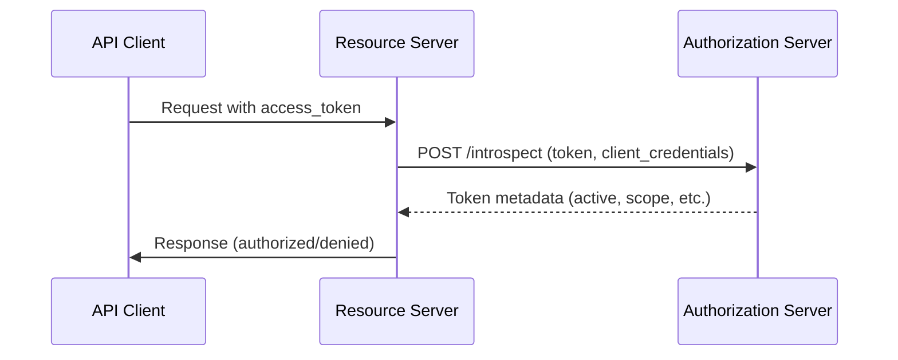
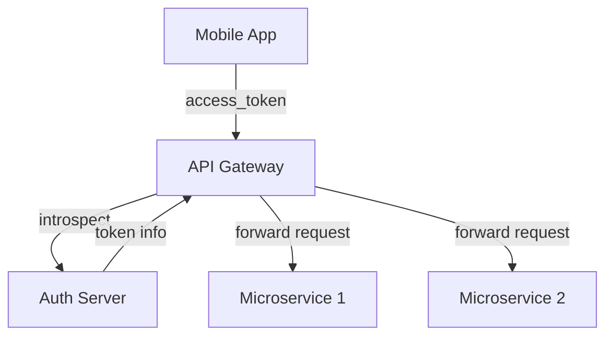

# Token Introspection avec Symfony 7.3

---
layout: default
---

# Token Introspection : vue d'ensemble

<v-clicks>

- ✅ Standard RFC 7662 OAuth 2.0 Token Introspection
- ✅ Support natif dans le composant Security de Symfony 7.3
- ✅ Approche de validation des tokens centralisée
- ✅ Détection immédiate des révocations

</v-clicks>

---

# Comment fonctionne la Token Introspection



<v-clicks>

- Le resource server valide les tokens en interrogeant l'authorization server
- Renvoie des métadonnées de token structurées (statut actif, scope, expiration)
- Utilise un HTTP POST avec les client credentials pour s'authentifier
- Format de réponse standardisé selon la RFC 7662

</v-clicks>

---

# Implémentation dans Symfony 7.3

```yaml
# config/packages/security.yaml
security:
    firewalls:
        main:
            access_token:
                token_handler:
                    oauth2_introspection:
                        endpoint: 'https://auth.example.com/introspect'
                        client_id: 'your-client-id'
                        client_secret: 'your-client-secret'
                        cache:
                            id: 'cache.app'
```

<v-clicks>

- `OAuth2TokenIntrospectionTokenHandler` intégré
- Endpoint d'introspection configurable
- Authentification par client credentials
- Couche de cache optionnelle
- Intégration transparente au firewall

</v-clicks>

---

# Token Introspection vs méthodes traditionnelles

<div class="grid grid-cols-2 gap-8">

<div>

### Token Introspection

<v-clicks>

- ✅ Validation centralisée
- ✅ Détection immédiate des révocations
- ✅ Pas de gestion de JWKS nécessaire
- ✅ Conforme à la RFC 7662
- ❌ Surcoût réseau
- ❌ Dépendance à l'authorization server

</v-clicks>

</div>

<div>

### Validation JWT locale

<v-clicks>

- ✅ Aucun appel réseau (après récupération des JWKS)
- ✅ Meilleures performances
- ✅ Fonctionne hors ligne
- ❌ Gestion des JWKS complexe
- ❌ Détection des révocations différée
- ❌ Logique de validation locale

</v-clicks>

</div>

</div>

---

# Quand utiliser la Token Introspection

<v-clicks>

- 🔐 Applications à haute sécurité exigeant une révocation immédiate
- 🌐 Systèmes distribués avec authentification centralisée
- 🔄 Scopes/permissions de token qui changent souvent
- 🚀 Développement rapide (plus simple que les JWKS)
- 📱 Architectures mobiles / API-first

</v-clicks>

<alert type="info">

La Token Introspection est idéale quand vous avez besoin d'une validation de token en temps réel et que vous pouvez tolérer le surcoût réseau.

</alert>

---

# Exemple de réponse d'introspection

```json
{
  "active": true,
  "scope": "read write",
  "client_id": "l238j323ds-23ij4",
  "username": "johndoe",
  "token_type": "Bearer",
  "exp": 1493726400,
  "iat": 1493722800,
  "sub": "Z5O3upPC88QrAjx00dis",
  "aud": "https://protected.example.net/resource",
  "iss": "https://server.example.com/"
}
```

<v-clicks>

- `active` : booléen indiquant la validité du token
- `scope` : scopes du token séparés par des espaces
- `exp` : timestamp d'expiration
- Claims standards plus métadonnées personnalisées

</v-clicks>

---

# Optimisation des performances : le cache

```yaml
# Activer le cache pour les résultats d'introspection
security:
    firewalls:
        main:
            access_token:
                token_handler:
                    oauth2_introspection:
                        # ... reste de la config
                        cache:
                            id: 'cache.app'
                            lifetime: 300  # 5 minutes
```

<v-clicks>

- Réduit les appels réseau pour les tokens fréquemment utilisés
- Durée de vie du cache configurable
- Utilise le composant Cache de Symfony
- Équilibre entre performance et fraîcheur des données

</v-clicks>

---

# Migration de UserInfo vers Introspection

<div class="grid grid-cols-2 gap-8">

<div>

### Avant : endpoint UserInfo

```yaml
security:
    firewalls:
        main:
            access_token:
                token_handler:
                    oidc_user_info:
                        endpoint: 'https://auth.example.com/userinfo'
```

</div>

<div>

### Après : Token Introspection

```yaml
security:
    firewalls:
        main:
            access_token:
                token_handler:
                    oauth2_introspection:
                        endpoint: 'https://auth.example.com/introspect'
```

</div>

</div>

<v-clicks>

- Structure de configuration similaire
- Endpoint et format de réponse différents
- L'introspection fournit plus de métadonnées
- Les deux utilisent les client credentials

</v-clicks>

---

# Points de sécurité à considérer

<v-clicks>

- 🔒 Toujours utiliser HTTPS pour l'endpoint d'introspection
- 🗝️ Stocker les client credentials de façon sécurisée
- ⏱️ Peser les compromis du cache (fraîcheur vs performance)
- 🛡️ Implémenter une gestion d'erreurs correcte
- 📡 Surveiller la disponibilité de l'authorization server
- 🔄 Prévoir des mécanismes de repli en cas de panne

</v-clicks>

<alert type="warning">

La Token Introspection crée une dépendance à l'authorization server : concevez pour la résilience !

</alert>

---

# Cas d'usage réel : API Gateway



<v-clicks>

- La gateway valide tous les tokens entrants
- Logique d'autorisation centralisée
- Les microservices font confiance à la validation de la gateway
- Un pattern d'architecture qui passe à l'échelle

</v-clicks>

---

# En résumé : les bénéfices de la Token Introspection

<v-clicks>

1. **Développement simplifié** : pas de code de gestion des JWKS ni de validation de signature
2. **Contrôle centralisé** : la logique d'autorisation au même endroit
3. **Validation en temps réel** : détection immédiate des révocations
4. **Conforme au standard** : suit la spécification RFC 7662
5. **Flexible** : fonctionne avec n'importe quel authorization server OAuth 2.0

</v-clicks>

<alert type="info">

La Token Introspection dans Symfony 7.3 offre une alternative puissante et conforme aux standards face aux méthodes traditionnelles de validation de token.

</alert>
